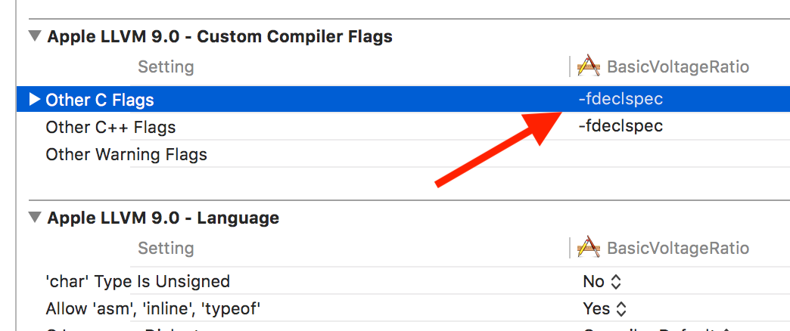

## Cinder-poPhidgets

Forked from the repo [here](https://github.com/camb416/Phidgets-CinderBlock), although the Phidgets API has changed fairly significantly since the original repo was created.

This is the Phidgets CinderBlock, designed for use with the open-source C++ library Cinder: http://libcinder.org

Phidgets are a great line of products for USB Sensing and control. For simple input and output, they're an off-the-shelf
solution that precludes any time-consuming development of custom microcrontroller-based hardware.

### API version
Integrates Phidgets API v2.2.

### General
Currently includes a class for a VoltageRatioInput device, which can be a slider or a distance sensors. The API has changed such that the classes are type-specific, rather than device-specific. I've been testing with [this slider](http://www.phidgets.com/products.php?category=4&product_id=1129_0), plugged into the [PhidgetInterfaceKit 8/8/8](https://www.phidgets.com/?tier=3&catid=2&pcid=1&prodid=1021), although the tests have been with an older version of the interface kit.

There's lots more about working with the Phidgets API here:
http://www.phidgets.com/programming_resources.php

### Libraries

The Windows 64-bit libraries are included in this block. The Mac libraries require the installer available [here](https://www.phidgets.com/docs/OS_-_macOS). It installs the following files:

| File | Description | Location |
| :--------------------- | :--------------------------------- | :--------------------------- |
| Phidget22.framework    | contains library, used at run-time | `/Library/Frameworks`        |
| Phidget.kext           | kernel extension                   | `/System/Library/Extensions` |
| phidgetnetworkserver22 | Phidget Network Server             | `/usr/local/bin`             |

### Development notes

When setting this up in Mac OSX, you will need to add a flag for the compiler. Add `-fdeclspec` to "Other C Flags" in the target's Build Settings under "Apple LLVM 9.0 - Custom Compiler Flags" (this will automatically add it to "Other C++ Flags" as well).

